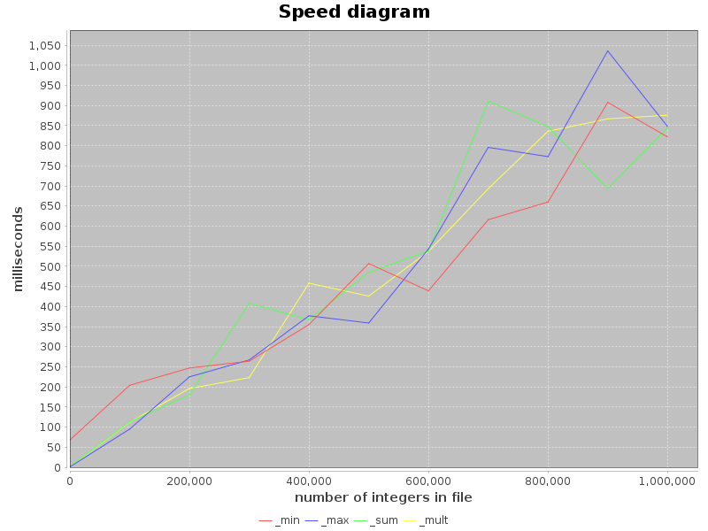

# JavaTests and CI integration

Программа позволяет считывать из файла числа, а далее отдельными функциями искать среди этих чисел минимальное число, максимальное число, считать их общую сумму и произведение.

Числа в файле записаны в одной строке, друг от друга отделены пробелами. В файле есть минимум одно число. Максимально возможное количество чисел в файле - 1 млн.

Имя файла по умолчанию - numm.rtf.

#### Результаты последнего запуска тестов:

#### График зависимости времени выполнения от количества чисел в файле:

